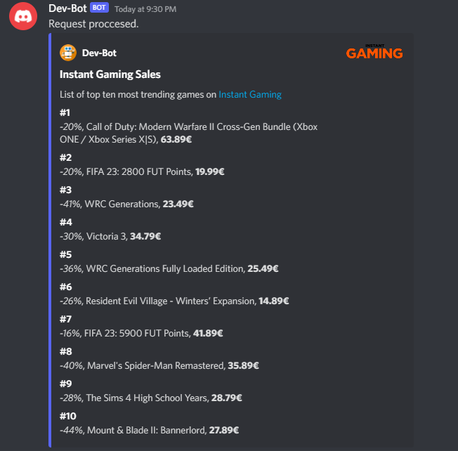

### Discord Bot

[](https://github.com/toniilic1/Discord-Bot)
[](https://github.com/toniilic1/Discord-Bot)
[](https://github.com/toniilic1/Discord-Bot/graphs/commit-activity)
[](https://github.com/toniilic1/Discord-Bot/blob/master/LICENSE.txt "License")

## Introduction
Currently has a function to scrape top 10 trending games from instant gaming and return it in a embeded message after using a slash command /keys.

A lot more features are planned and upcoming.

Made with Pycord.

How it looks:


## Installation
1. Clone the project:
- ```git clone https://github.com/toniilic1/Discord-Bot.git```

2. Create a virtual env:
- ```py -m venv .venv```
- ```.venv\scripts\activate```

3. Install the requirements.txt:
- ```pip install -r requirements.txt```

4. Create a python file that contains a bot token id variable and import it in bot.py.

5. Run bot.py and in your text channel type /keys.

## License

MIT
